## Preparación de  Maquinas

* Instalación de Workbench Server

  Le damos a siguiente

  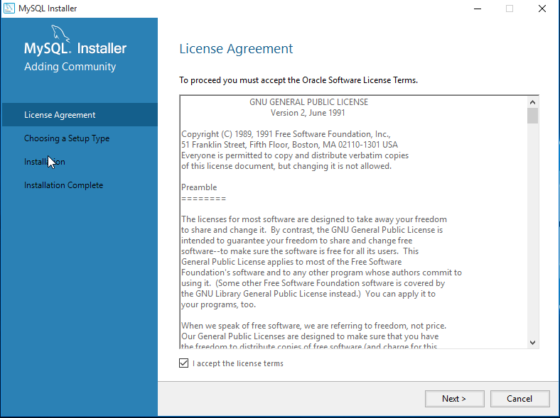

  Elegimos la opcion Developer Default

  

  Ejecutamos

  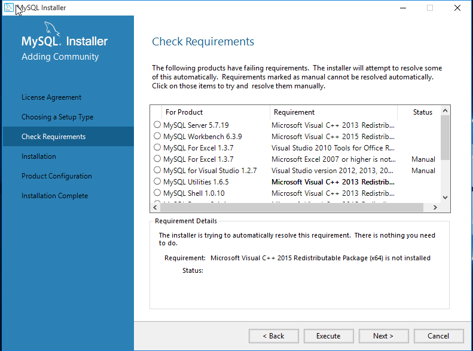

  Tenemos que instalar los paquetes de Microsoft Visual C++ 2013 y 2015

  > Si ya los tenemos actualizados no lo pedira.

  

  

  Una vez terminada la ejecucion le damos a siguiente

  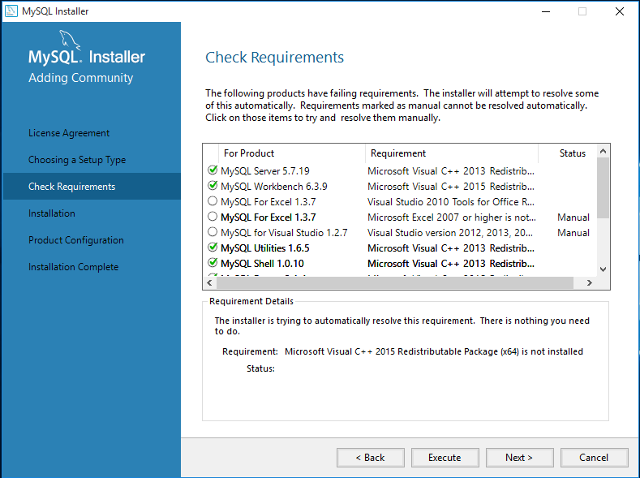

  Ahora le damos a ejecuta y empezara la instalación

  

  Una vez finalizado le damos a siguiente

  

  Ahoara vamos a la configuración.

  

  Elegimos Standalone MySQL y le damos siguiente

  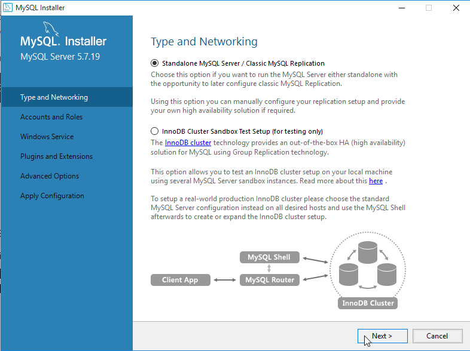

  Dejamolos los valores por defecto

  

  Introducimos la contraseña que vamos a usar como root

  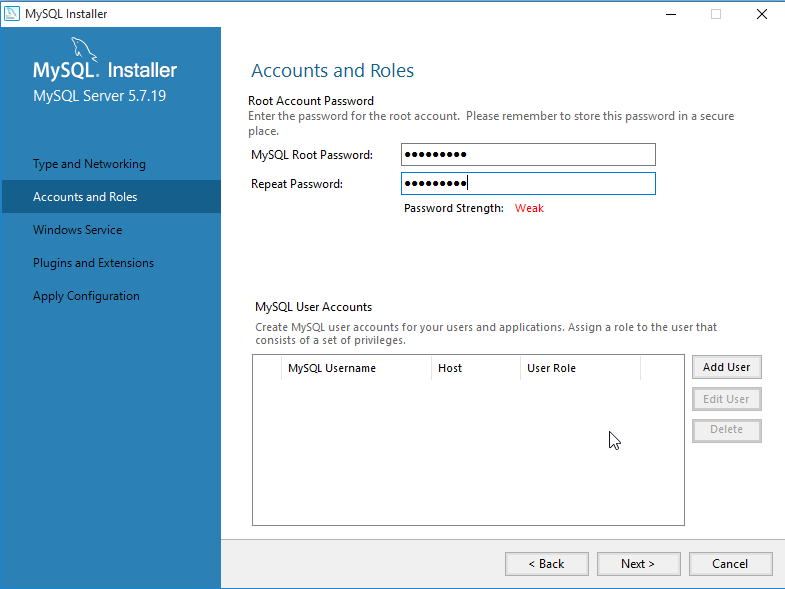

  Valores por defecto

  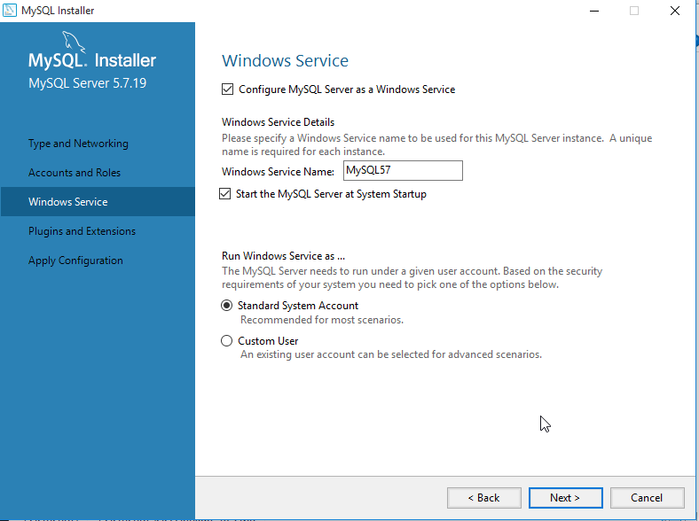

  

  Le damos a finalizar y siguimos con las configuración

  

  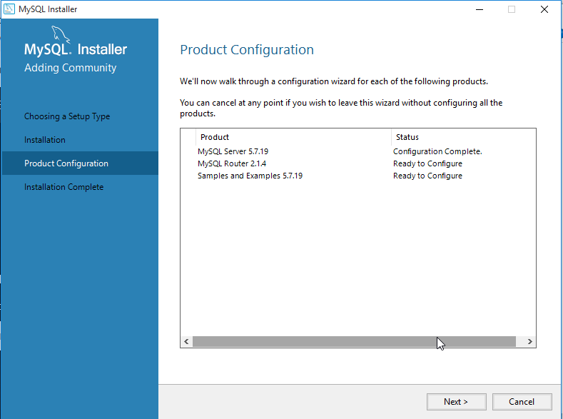

  Dejamos los valores por defecto, vamos a la siguiente configuración

  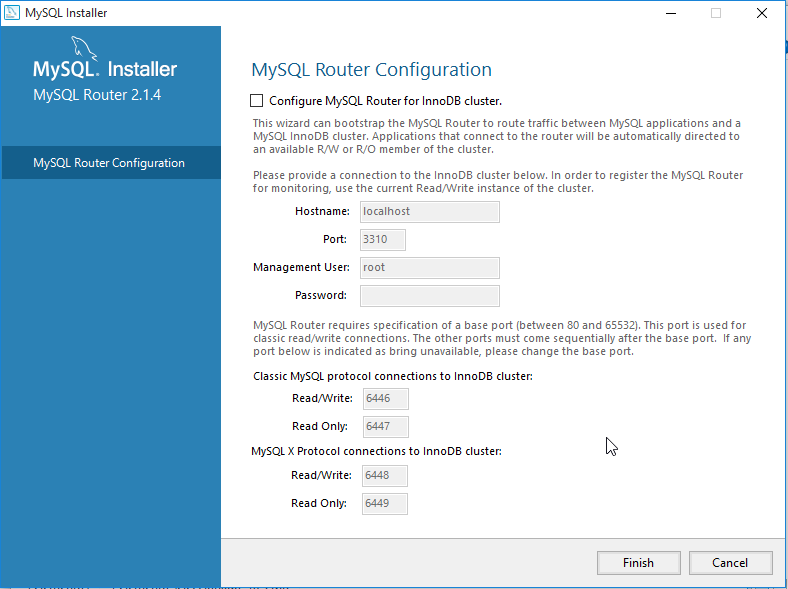

  Probamos la conexion del root con la contraseña creada anteriormente y le damos a siguiente

  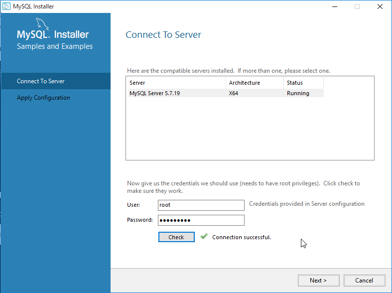

  Le damos a finalizar y terminamos la instalación

  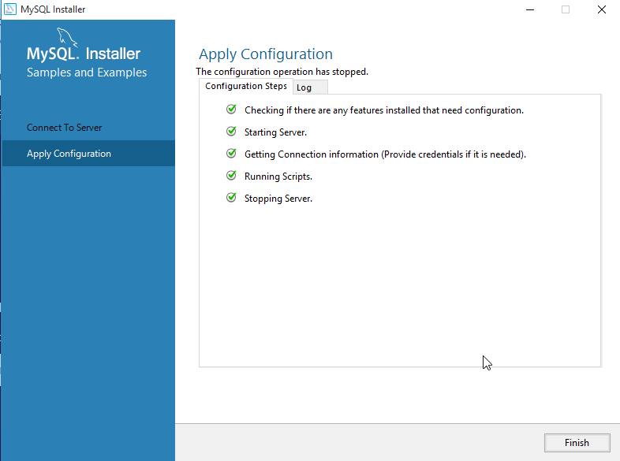

  

  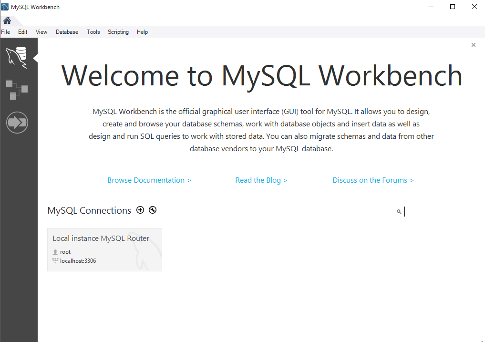

  * Creación del usuario

  Entramos en nuestra base de datos , vamos a usuarios y privilegisos y creamos nuestro usuario para entrar con la maquina del cliente.

  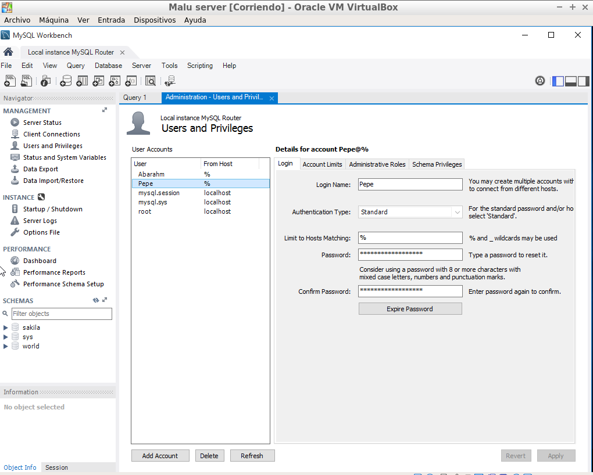

  * Instalación de Workbench cliente

  Hacemos los mismo pasos anteriores solo que desactivamos el servidor, abrimos la herramienta de Workbench.

  > Tenemos que instalar tambien los paquetes 2013 y 2015 de Microsoft Visual C++

  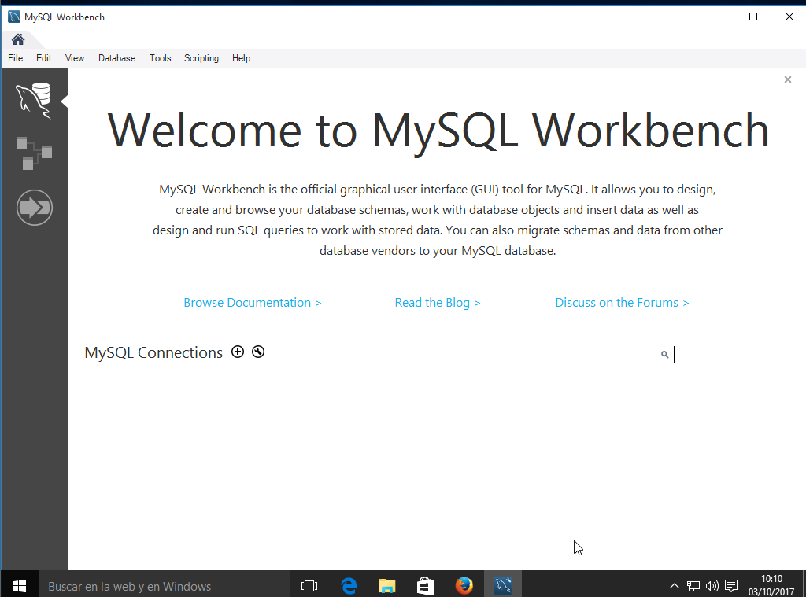

  Vamos al boton mas y colocamos la IP del servidor y el usuario con que vamos a acceder y establecemos conexion.

  

  ### Instalación de XAMPP

  Instalamos XAMPP  para utilizar la herramienta phpmyadmin.

  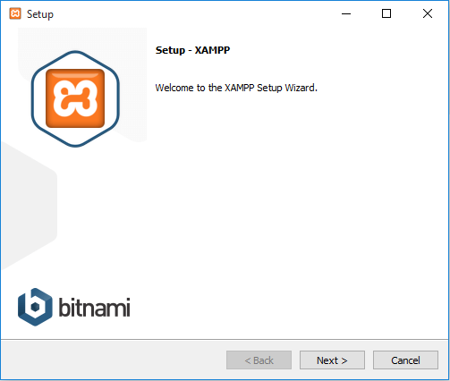

  Le damos a siguiente

  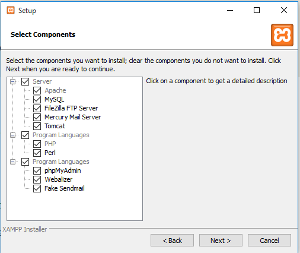

  Utilizaremos el servidor apache y phpmyadmin

  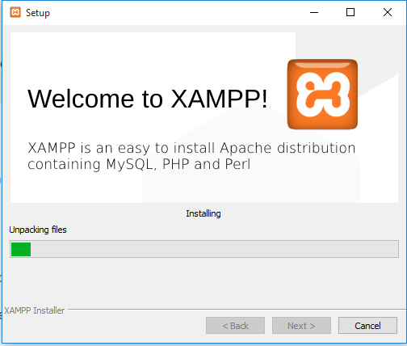

  Una vez terminada la Instalación le damos a finalizar y vamos a modificar unos archivos.

  

  ### Configuración

  Vamos a la carpeta de XAMPP/phpmyadmin/sql y buscamos el create_tables.sql y lo ejecutamos

  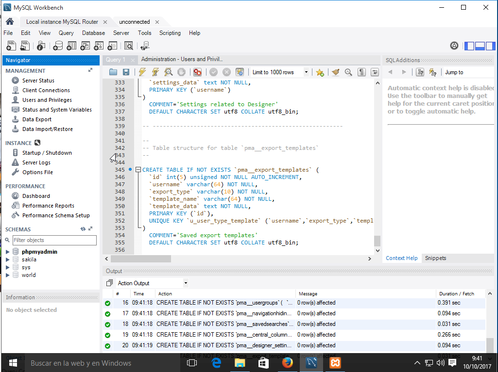

  Una vez terminado esto vamos otra vez a la carpeta de XAMPP/phpmyadmin y modificamos el archivo config.inc.php y añadimos estas lineas.

  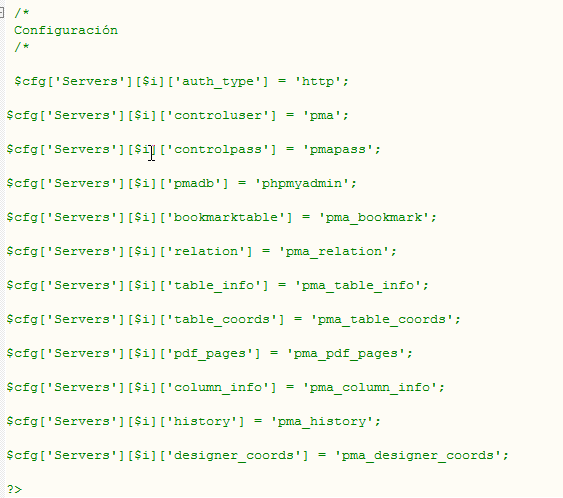

  Ahora creamos un nuevo usuario con privilegios.

  

  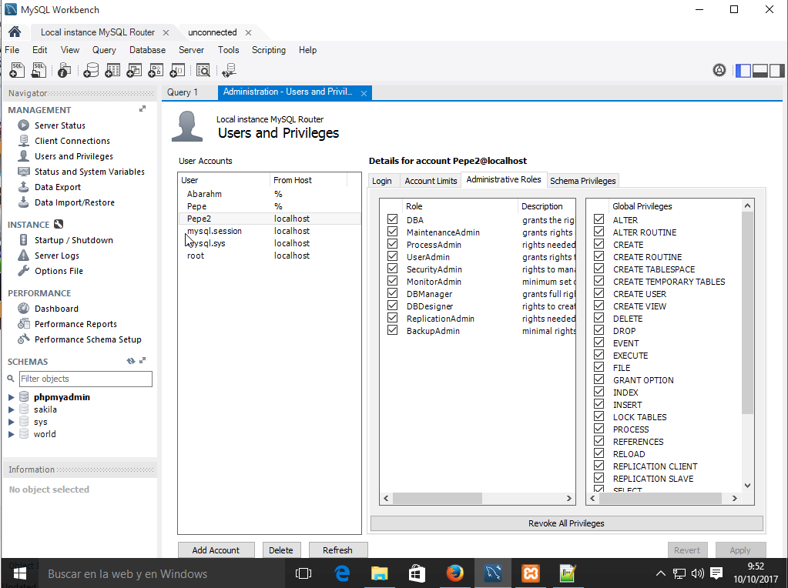

  Levantamos nuestro servidor apache

  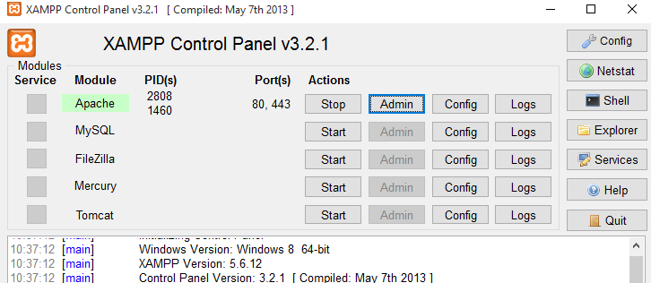

  Hacemos click en Admin y vamos al apartado de phpmyadmin

  

  Y si todo esta correcto tiene que salir el administrador de phpmyadmin

  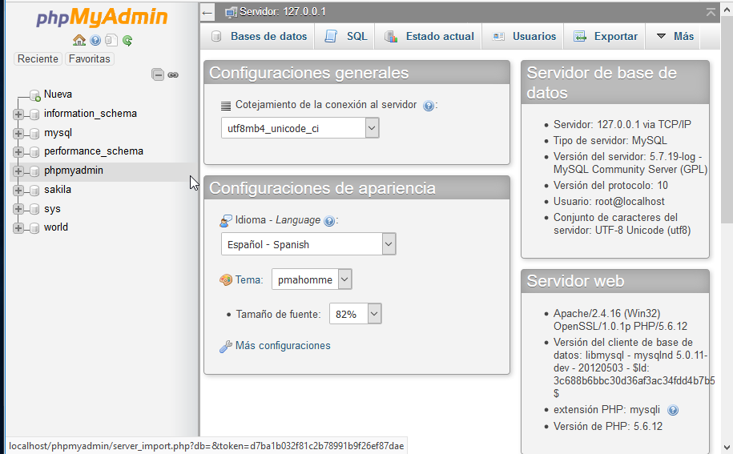
