### Instalación de MySQL en Ubuntu

* Configuración de la maquina

  Ponemos la IP del Servidor fija:

  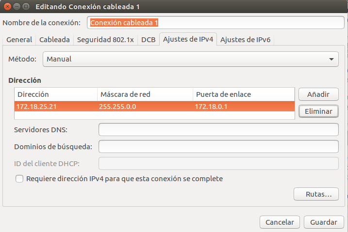

* MySQL

  Abrimos un terminal e instalamos el programa.

  > sudo apt-get install mysql-server

  

  En mitad da la instalación nos pedira introducir una contraseña para "**root**"

  

  Volvemos a introducir la contraseña.

  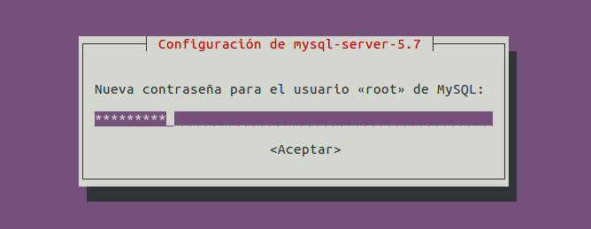

  Ahora instalamos el "**mysql-client**" y "**mysql-workbench**"

  > sudo apt-get install mysql-client

  

  > sudo apt-get install mysql-workbench

  

  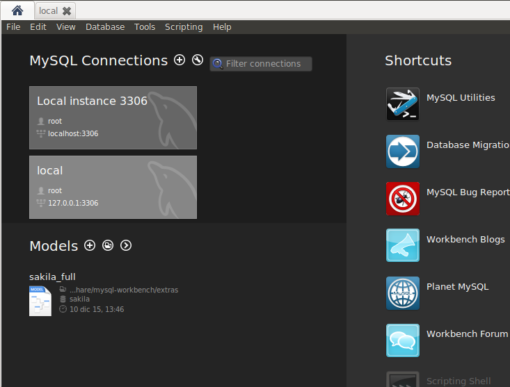

### Instalación Phpmyadmin

  Una vez terminado estoy siguimos en el terminal e instalamos "**phpmyadmin**"

  > sudo apt-get install phpmyadmin

  

  En medio de la instalación elegimos nuestro "**servidor web apache2**"

  

  En la siguiente pantalla le damos al **YES**

  

  Y tenemos que instroduccir una contraseña para el usuario phpmyadmin.

  

  Comprobamos en un navegador si esta funcionando correctamente el **phpmyadmin**

  > localhost

  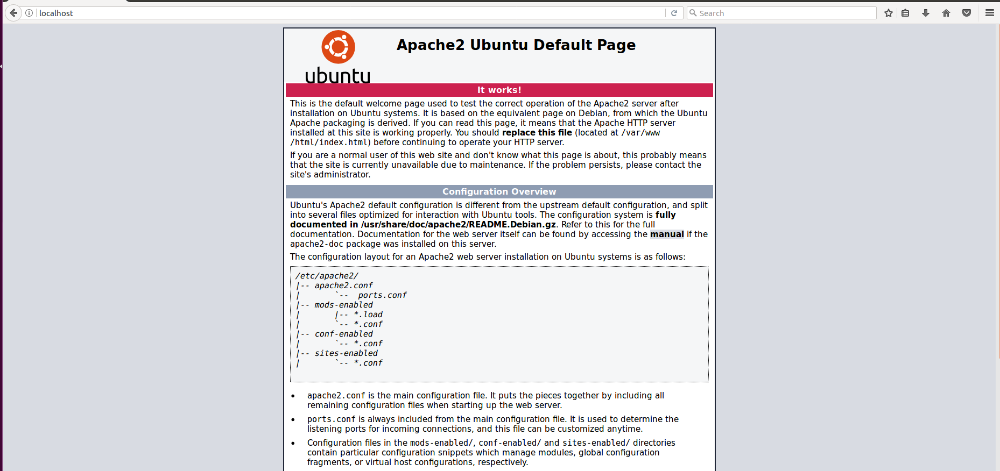

  > localhost/phpmyadmin

  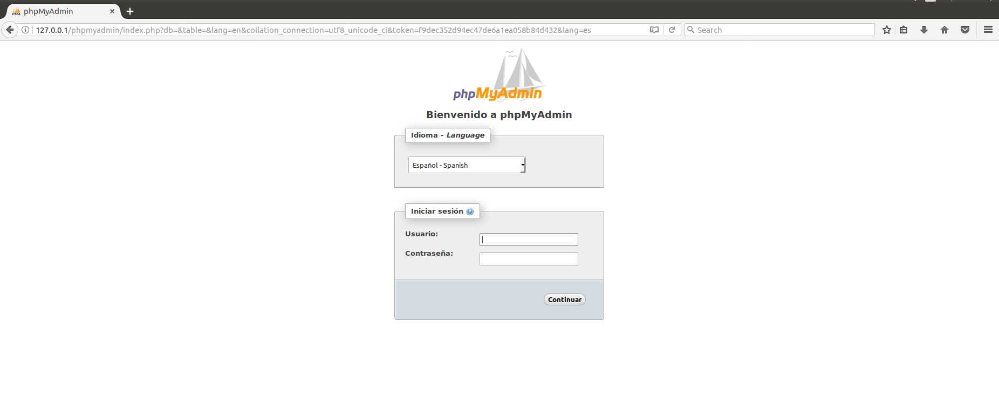

### Creación de un usuario

  Iniciamos el programa Workbench, vamos al apartado Usuarios y privilegios, y lo creamos.

  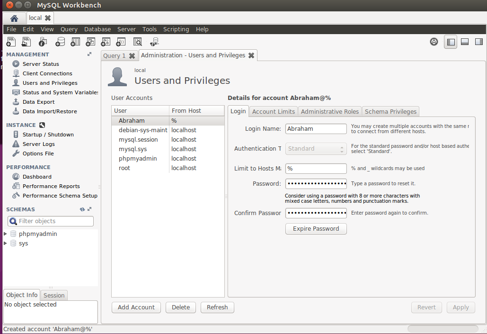

  Tambien le damos privilegios de administrador.

  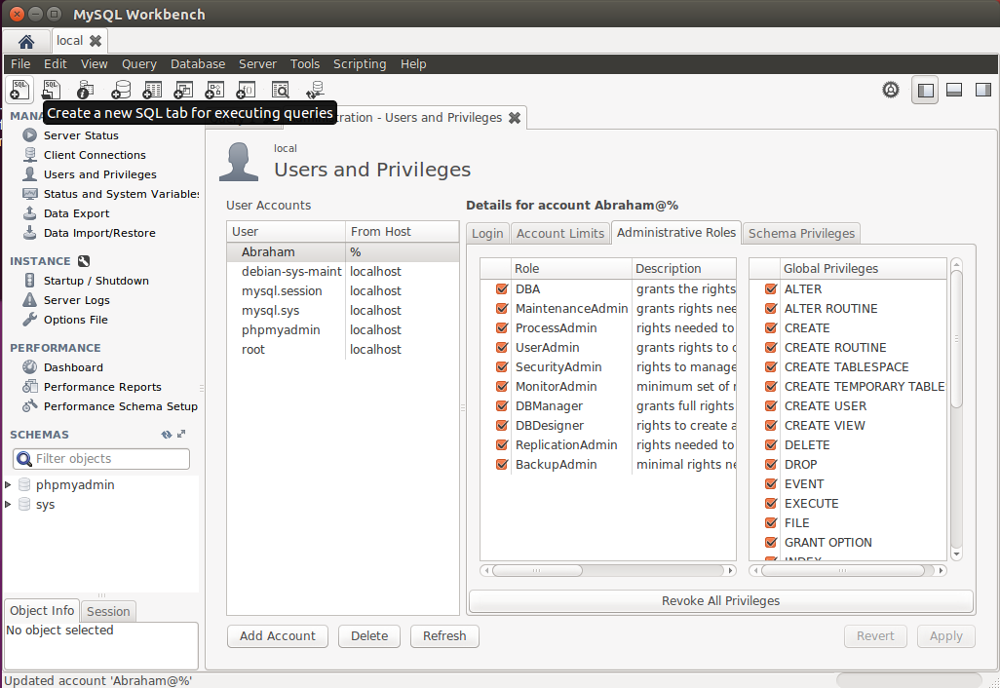

### Comprobación desde una maquina cliente.

  Instalamos el mysql-client, mysql-workbench

  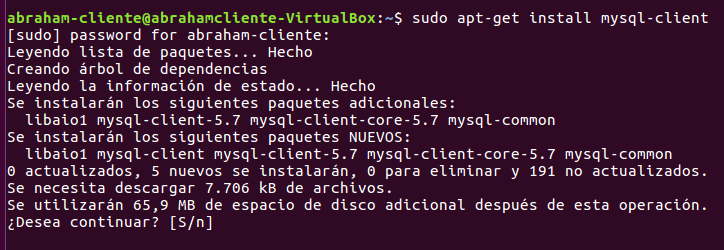

  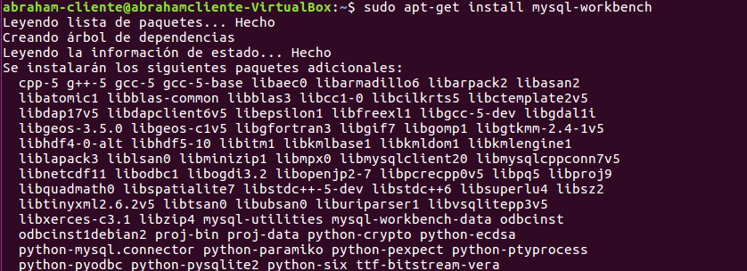

  Ejecutamos el Workbench y iniciamos una conexion con nuestro Servidor

  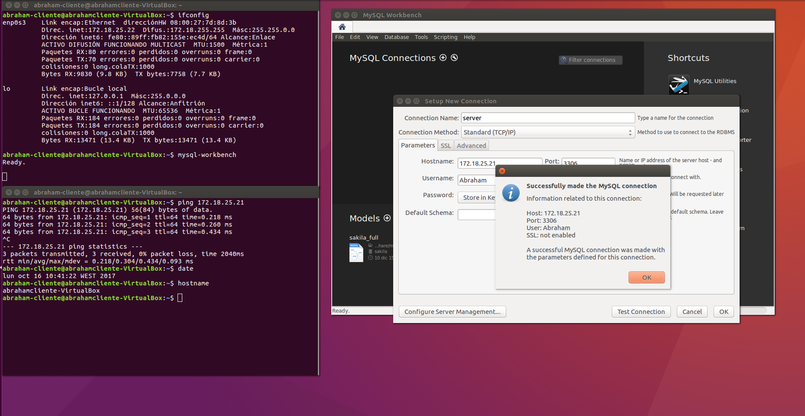

  Y vamos al nevegador para comprobar que podemos acceder al phpmyadmin con la **IP del servidor**.

  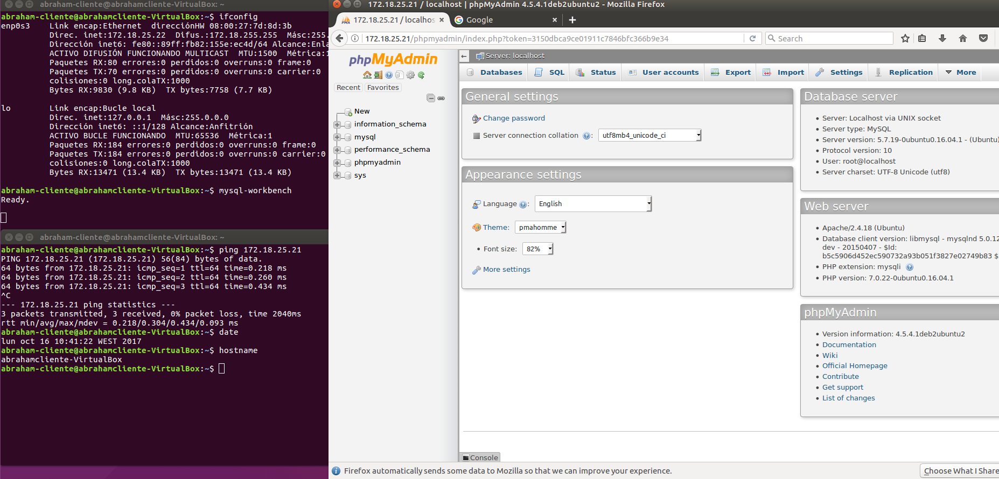
