# Fichero de Opciones y variables de servidor

1 Ficheros de opciones

El servidor dispone de un conjunto de variables que determinan su funcionamiento. Una de las tareas más importantes del administrador implica el conocimiento y ajuste óptimo de los valores de las mismas según los requerimientos de las aplicaciones.
Debemos diferenciar entre variables del servidor y las opciones que permiten modificar el valor de las variables.
Podemos ajustar los valores de las diferentes variables usando ficheros de opciones, incluyendo dichas opciones cuando arrancamos el servidor; o modificándolas con el comando SET (sólo en el caso de ser dinámicas).
La mejor forma de conocer las variables es buscarlas cuando se necesiten. En tal caso debemos consultar el manual donde disponemos de una referencia detallada, donde para cada variable se detallan normalmente su nombre largo y corto para usar en la línea de comandos, su nombre para ficheros de opciones (no siempe coincide), si son modificables con SET, el nombre de la variable, su alcance (global o de sesión) y si es dinámica (modificable en tiempo de ejecución), su dominio o valores permitidos, su tipo y su valor por defecto.

### Ajustar variables con Ficheros de Opciones.

Cuando queremos que las opciones sean permanentes lo normal es hacer que los programas de MySQL (mysqld entre ellos) puedan leer opciones de inicio desde ficheros de opciones (también llamados ficheros de configuración). Estos proporcionan una forma conveniente de especificar opciones comúnmente usadas. Este fichero determina el funcionamiento de nuestro servidor.

> Pagina de opciones y ficheros http://dev.mysql.com/doc/refman/5.7/en/option-files.html

2.Encuentra el fichero my.ini o my.cnf de tu instalación de MySQL (podría no estar en una ubicación no estándar).

> Se en encuentra en `/etc/mysql`
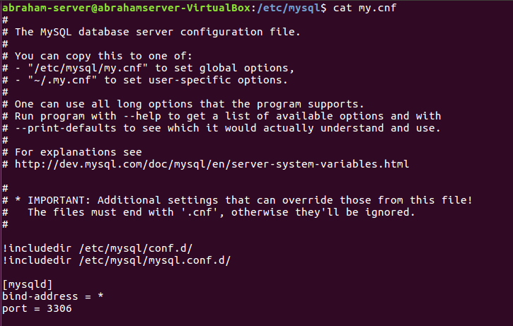

3.¿Cómo se escribe un comentario en este fichero?¿Y un grupo de opciones?¿Todas las opciones tienen un valor?

> 1.Comentario = #

> 2.Grupo = [Client]

> 3.NO

4.Ejecuta "mysqld --verbose --help" desde una consola para ver una lista de las variables del servidor. Para ver mejor el texto mejor redirecciona la salida a fichero.

> `mysql --verbose -help > /var/lib/mysql-files/verbose.txt`

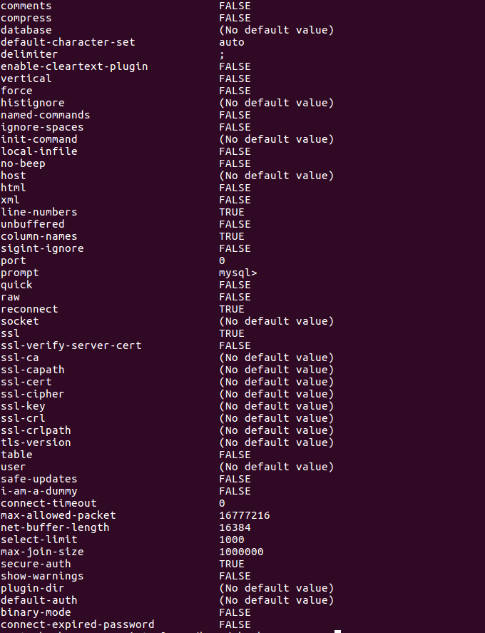

5.Explica qué significan y que se consigue con cada una de las variables del siguiente fichero de configuración

>[client]

>port=3306 => Puerto de escucha.

>password="telesforo"; => Contraseña que utiliza el cliente.

>[mysqld]

>port=3306 => Puerto de escucha

>key_buffer_size=16M => Tamaño maximo de memoria de clave 16 MB

>max_allowed_packet=8M => Tamaño maximo de paquetes 8MB

>[mysqldump]

>quick => Cundo un copia de seguridad este usando "**musqldump**" se hara en modo rapido.

## 2-Variables del servidor

> Paginas disponibles:

>"Server System Variables" http://dev.mysql.com/doc/refman/5.7/en/server-system-variables.html

>"Using System Variables" http://dev.mysql.com/doc/refman/5.7/en/using-system-variables.html

  1.Define qué son las variables del servidor.

  >

  2.Usa el comando "SHOW VARIABLES" para conocer el valor de todas las variables y enviar el resultado a un fichero.

  > `mysql -u root -p -e "show variables;" > /var/lib/mysql-files/variables.txt`

  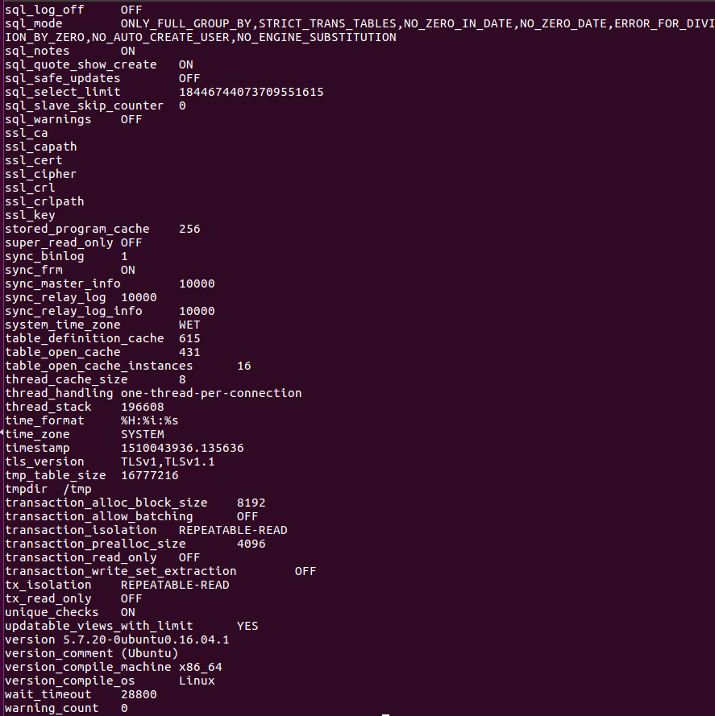

  3.Repite lo anterior para mostrar solo las variables relacionadas con el motor "InnoDB".

  > `show variables like "%InnoDB%"`

  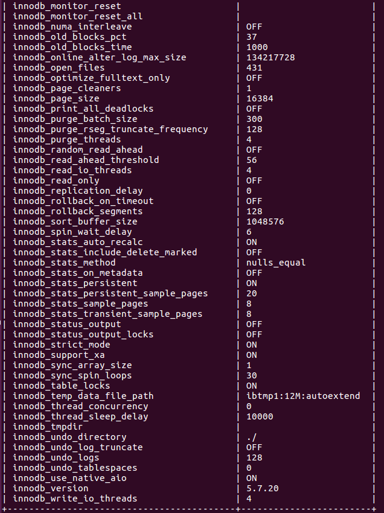

  4.Para gestionar variables tenemos, como hemos visto, el comando SHOW "comando":

  a)Cómo mostrar todos los motores de almacenamiento.

  > `show engines`

  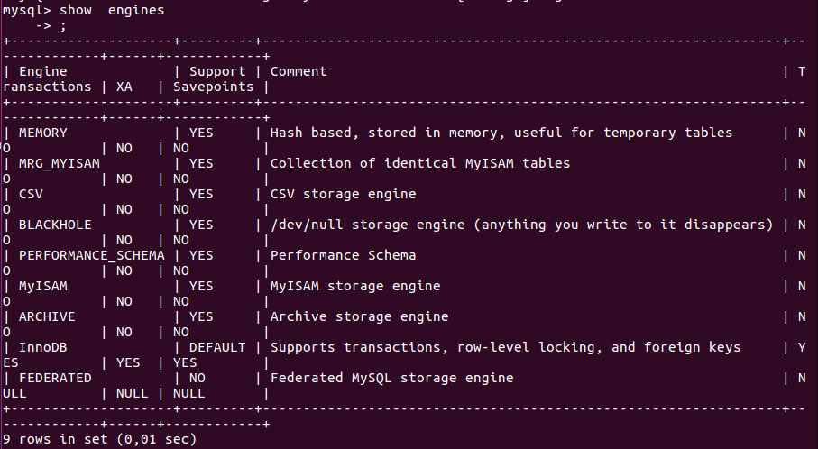

  b)Cómo mostrar el estado actual del servidor.

  > `show status`

  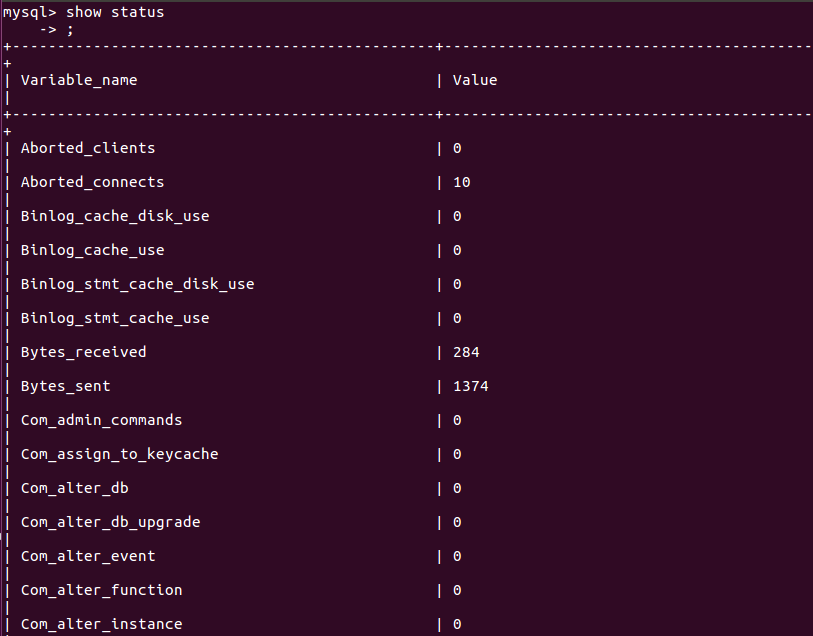

  c)Cómo averiguar todos los clientes que están conectados al servidor.

  > `show processlist`

  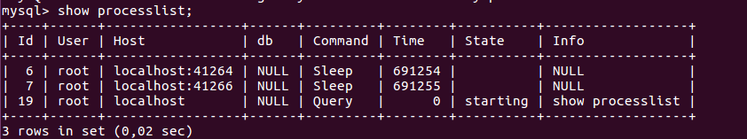

  d)Cómo conocer todas las tablas que están abiertas.

  > `show open tables`

  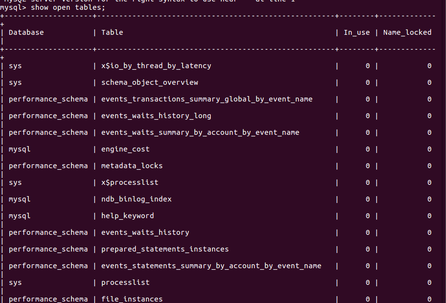

## 3-Variables de estado

  > Paginas disponibles.

  >"Server Status Variables" http://dev.mysql.com/doc/refman/5.7/en/server-status-variables.html

  >"SHOW STATUS Syntax" http://dev.mysql.com/doc/refman/5.7/en/show-status.html

  >"SHOW Syntax" http://dev.mysql.com/doc/refman/5.7/en/show.html

  1.Define qué son las variables de estado.

  2.Usa el comando "SHOW STATUS" para conocer el valor de todas las variables.

  

  3.Haz que uno o más de tus compañeros se conecte a tu servidor (puede que por cuestión de permisos no os podáis conectar).

  >`mysql -h IP_Servidor -u Usuario -p`

  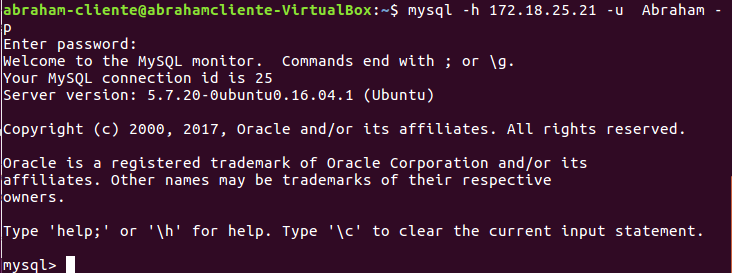

  4.Comprueba quién está conectado usando el comando correspondiente (Pista: es un comando visto SHOW XYZ).

  >`show processlist`

  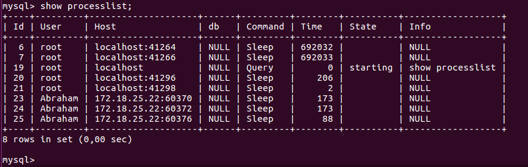

  5.Intenta desconectarlo con el comando "kill"

  > `kill 25` Matamos el id del cliente

  

  6.¿Cuántas consultas se están ejecutado hasta el momento en tu servidor MYSQL? ¿Y si se trata de consultas lentas?

  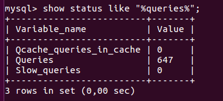

  > Consultas que se están ejecutando => 647

  > Consultas lentas => 0

  7.Un estado informa  el sobre el máximo de conexiones concurrentes que se ha dado en la sesión de trabajo. ¿Cuál es?

  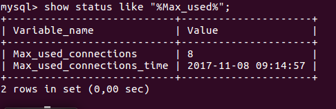

  > Conexiones => 8

## 3-Variables dinámicas

> Paginas disponibles

>"Dynamic System Variables" http://dev.mysql.com/doc/refman/5.7/en/dynamic-system-variables.html

>SET Syntax" http://dev.mysql.com/doc/refman/5.7/en/set-statement.html

1.Detalla los posibles atributos que tendría una variable de servidor como "port".

* Command-Line Format

  * System Variable
    * Name: port
    * Variable Scope: Golbal
    * Dynamic Variable: No
  * Permitted Values
    * Type: integer
    * Default: 3306
    * Min Value: 0
    * Max Value: 65535

2.-¿Cómo podemos saber si una variable es dinámica o no?

Las que se muestran en show variables son dinamicas y las que semuestran show status son fijas.

3.-¿Qué hace la variable "uptime"?

  > Tiempo que lleva activo el servidor desde su último reinicio o puesta a 0

  * Indica su valor en tu servidor
    >El tiempo de funcionamiento.

    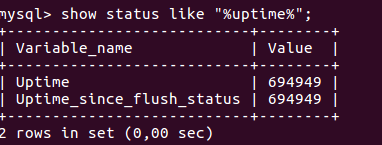

  *  ¿Es posible modificar su valor con comando SET?

  No , no es dinamica.

  4.- Localiza la variable que establece el límite de conexiones concurrentes. ¿Cuál es?

> Max_used_connections

  

  *  Modifícala y establece un máximo de 100 conexiones concurrentes

  > Vamos al archivo `/ect/mysql/my.cnf`

  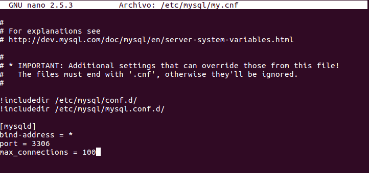

  > Reiniciamos el servidor para cargar la variable y comprobamos.

  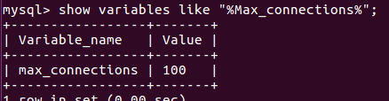
