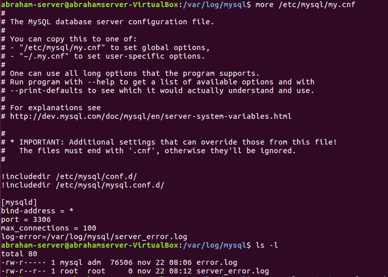
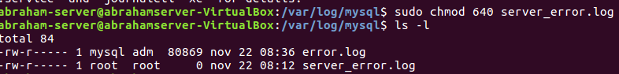
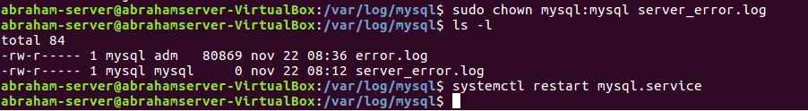
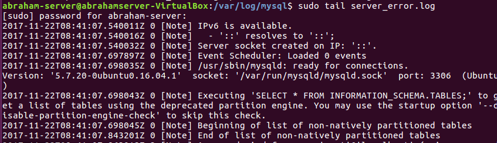
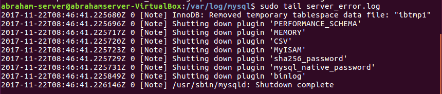
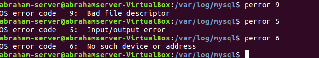
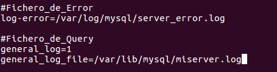
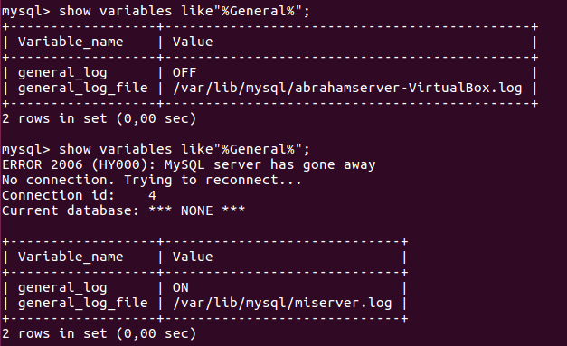
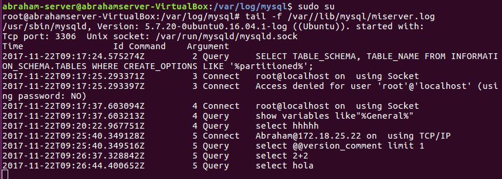
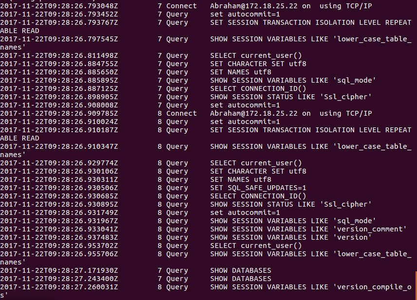

# Ficheros Log

* 1.Ficheros LOG: Error LOG

  * El fichero "Error Log" registra problemas encontrados iniciando, ejecutando o parando mysqld.

  > MySQL Server Logs: http://dev.mysql.com/doc/refman/5.7/en/server-logs.html
  he Error Log: http://dev.mysql.com/doc/refman/5.7/en/error-log.html

    *  1.Explica qué es y para qué sirve el "ERROR LOG"

      * Es un archivo que almacena errores de sistema , usuarios, etc.
      * Para saber que fallo de sistema o de usuario , etc  que pueda darse en un momento en concreto.

    *  2.Indica al servidor en "my.cnf" que registre los errores en un fichero llamado "server_error". Reinicia el servidor y comprueba los mensajes visualizando dicho fichero

      * Modificamos el archivo my.cnf para agregar un fichero que almacene los errores del servicio.

        

      * Como creamos el fichero tenemos que cambiar los permisos , grupo y reiniciamos.

        * chmod

          
        * chown y reinicio

          
        * Comprobación

          

      > Para no tener que hacer esto solo modificamos el archivo my.cnf, para que automaticamente te cree el archivo con permisos y grupo correspondiente.

    *  3.Detén el servidor abruptamente (haz lo que sea necesario) y comprueba cómo se ha modificado dicho fichero.

      * Para el servicio

        
      * Comprobación

        

    *  4.Prueba la función "perror" incluida en el directorio bin. ¿Cuál es su objeto?

      * Perror

        

      * Es el tipo de error que quieres consultar con el codigo correspondiente.

  > Pagina a consultar http://dev.mysql.com/doc/refman/5.7/en/perror.html

* Ficheros LOG: General Query LOG

  * El fichero "Global Query  Log" registra las conexiones establecidas por los clientes y las sentencias ejecutadas por ellos.

    > Paginas para consultar:
    > MySQL Server Logs: http://dev.mysql.com/doc/refman/5.7/en/server-logs.html
    The General Query Log: http://dev.mysql.com/doc/refman/5.7/en/query-log.html

    * 1.Explica qué es y para qué sirve el "GENERAL QUERY LOG"

      * Para registrar conexiones y consultas de usuarios.

    * 2.Configura MySQL para registrar consultas generales en el fichero denominado "miserver.log". Comprueba su funcionamiento haciendo que un compañero se conecte a tu servidor y ejecute varias consultas.

      * Volvemos a modificar el archivo my.cnf para volcar a un fichero las conexiones y consultas que hacen los usuarios.

      * my.cnf

        

        

      * Comprobación con el cliente.

        

    * 3.Averigua viendo el fichero "miserver.log" la hora en que se conectó tu compañero y ejecutó las consultas del apartado anterior.

      

    * 4.Accede al servidor a través de Workbench. ¿Qué se registra en "general_log"?¿Hay alguna diferencia respecto al cliente mysql ?

      * general_log con Workbench

        

      * Registra listados de base de datos , modifica el caracter a utf8 , un listado de variables, etc.

      * La diferencia entre clinte mysql y el de Workbench, es que Workbench carga una serie de consultas, modifica parametros y mysql solo establece una conexion simple.
