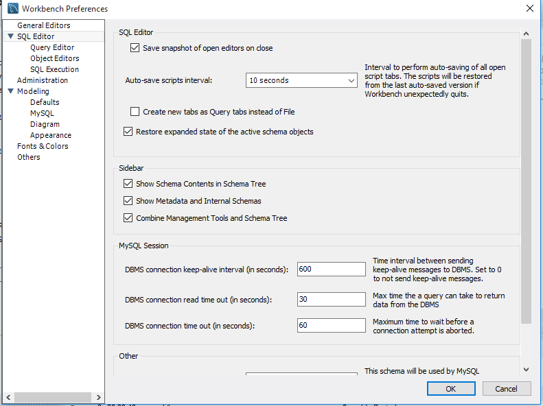

# Diccionario de Datos


* 1.Interrogando la bases de datos Information_schema, extrae información (atributos table_name, table_type) sobre las tablas que conforman la base de datos "sakila".
```
use Information_schema
select table_name, table_type
FROM TABLES
WHERE table_schema="sakila"
```
| Table_Name     | Table_Type     |
| :------------- | :------------- |
| actor          | BASE TABLE     |
| actor info     |     VIEW       |
| address        | BASE TABLE     |
| category       | BASE TABLE     |
| city           | BASE TABLE     |
| country        | BASE TABLE     |
| customer       | BASE TABLE     |
| customer list  |     VIEW       |


* 2.¿Cuál es el comando SHOW equivalente al anterior?
```
SHOW full table
```
  | TABLES                 | Table_Type     |
  | :-------------         | :------------- |
  | columns                | SYSTEM VIEW    |
  | columns privileges     | SYSTEM VIEW    |
  | engines                | SYSTEM VIEW    |
  | events                 | SYSTEM VIEW    |
  | files                  | SYSTEM VIEW    |
  | global status          | SYSTEM VIEW    |
  | global variable        | SYSTEM VIEW    |
  | key clumn usage        | SYSTEM VIEW    |

* 3.Repite lo mismo extrayendo la información sobre el esquema de una tabla en particular de la base de datos "sakila" (atributos column_name, data_type, is_nullable, column_default). Usar tabla columns
```
use Information_schema
select column_name, data_type, is_nullable, column_default
FROM  columns
WHERE table_name="ACTOR";
```
| column_name    | data_type      | is_nullable    | column_default |
| :------------- | :------------- | :------------- | :------------- |
| actor id       | smallint       | no             | null           |
| fist name      | varchar        | no             | null           |
| last name      | varchar        | no             | null           |
| last update    | timestamp      | no             | current  timestamp |

* 4.¿Cuál es el comando SHOW equivalente al anterior?
```
use sakila
SHOW columns
FROM ACTOR;
```
| Field          | type           | null           | key            | Default           | Extra          |
| :------------- | :------------- | :------------- | :------------- | :-------------    | :------------- |
| actor id       | smallint       | no             | PRI            | null              | auto increment |
| fist name      | varchar        | no             |                | null              |                |
| last name      | varchar        | no             | MUL            | null              |                |
| last update    | timestamp      | no             |                | current timestamp |on update current timestamp|

* 5.Atendiendo a la base de datos "Information_schema", ¿cuáles son las tablas principales según tu criterio? Puedes ayudarte para ver todas las tablas utilizando Workbench. Para ello ir a preferencias y activar ver los metadatos.

  * A mi criterio las mas importantes son "**ENGINES, USER PRIVILEGES**" pero en general todas son principales ya que contiene la información de las otras bases de datos.

    
